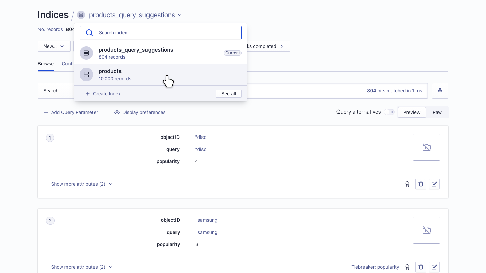
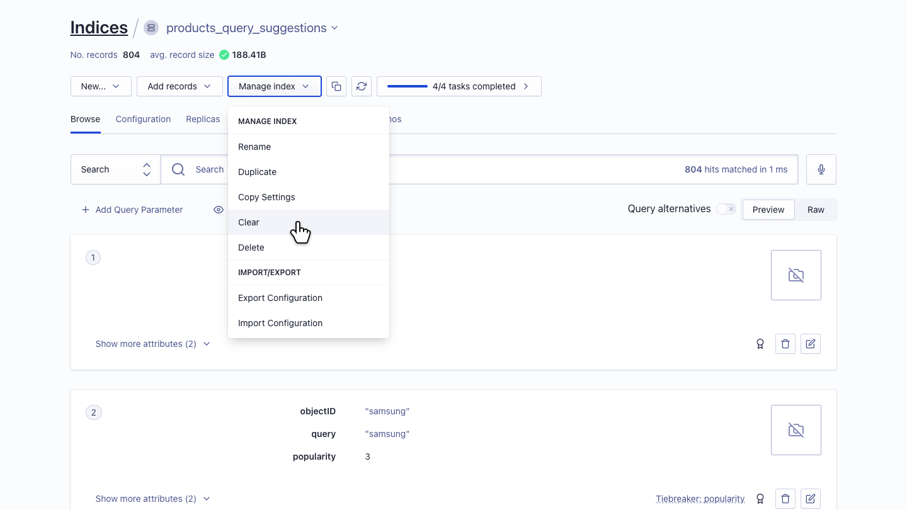
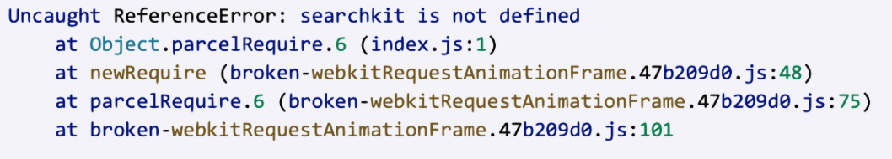

*Question 1*  

 
From: marissa@startup.com  
Subject:  Bad design  

Hello,  
  
Sorry to give you the kind of feedback that I know you do not want to hear, but I really hate the new dashboard design. Clearing and deleting indexes are now several clicks away. I am needing to use these features while iterating, so this is inconvenient.  
   
Thanks,  
Marissa  

--

From: gabriele.canepa@algolia.com  
Subject: Re: Bad design

Hi Marissa,

Thank you for this valuable feedback - I will take this back to our product team for further review.

Our main goal is to make our products easier to use and responding to our clients' needs, but we understand that UI changes can take some time to get used to. 

If you're working with multiple indices, you can now easily switch between them by clicking the name of the current index at the top of the `Indices` section of the dashboard. This will open a dropdown showing you a list of all your indices. Clicking on one will open it:

To clear, delete, or execute other actions on an index, you can click on `Manage Index` and select the option you want from the dropdown: 

You should be able to manage an index in just two clicks.

In case you are curious about the other features available in the new dashboard, you can check our updated guide [here](https://www.algolia.com/doc/guides/getting-started/quick-start/tutorials/getting-started-with-the-dashboard/), or see the different ways of managing indices [here](https://www.algolia.com/doc/guides/sending-and-managing-data/manage-your-indices/). 

If you wish to work outside the dashboard, I suggest you take a look at our easy-to-use [API clients](https://www.algolia.com/doc/guides/getting-started/how-algolia-works/in-depth/ecosystem/#using-the-api-clients/). They allow you to execute bulk actions and iterate faster.

Let me know if you have any question or want to schedule a call and see a live demo of these functionalities.

Best,  
Gabriele
  
---

*Question 2*:   
  
From: carrie@coffee.com  
Subject: URGENT ISSUE WITH PRODUCTION!!!!  
  
Since today 9:15am we have been seeing a lot of errors on our website. Multiple users have reported that they were unable to publish their feedbacks and that an alert box with "Record is too big, please contact enterprise@algolia.com".  
  
Our website is an imdb like website where users can post reviews of coffee shops online. Along with that we enrich every record with a lot of metadata that is not for search. I am already a paying customer of your service, what else do you need to make your search work?  
  
Please advise on how to fix this. Thanks.   

--

From: gabriele.canepa@algolia.com  
Subject: Re: URGENT ISSUE WITH PRODUCTION!!!!  

Hi Carrie,

We limit the size of records for performance reasons, with the limits depending on your active plan. When records are too large, we suggest you either upgrade your plan or decrease your records size.

In case you don't want to upgrade your plan, you can try to remove the unused attributes before uploading your records to the dashboard, so that you can free up space by only keeping the necessary information, while improving loading times. [This guide](https://www.algolia.com/doc/guides/sending-and-managing-data/prepare-your-data/how-to/reducing-object-size/#removing-unused-attributes/) goes into details and includes some examples that may help you.

Please let me know if you have any further questions or would like to set up a call to find together the best solution to your use-case. I understand this is an urgent issue, but hopefully we will be able to solve it quickly.

Best,  
Gabriele
  
---

*Question 3*:   

From: marc@hotmail.com  
Subject: Error on website  
  
Hi, my website is not working and here's the error:  
  
  
  
Can you fix it please?  

--

From: gabriele.canepa@algolia.com  
Subject: Re: Error on website

I'm sorry to hear your website is not working.

It seems that you’re trying to use Searchkit before it has been imported into your application. I recommend verifying that the package has been installed with a JavaScript package manager and is listed under your `package.json` dependencies. You should then import the `searchkit` function at the beginning of your `index.js` file, and use it later on in your code.

Please also note that Searchkit is not managed by Algolia, so it would be best to contact them directly if you encounter any further issues.

In the meantime, if you have any issue regarding your account or the services you are using, feel free to contact me, and I’ll be happy to address any questions you might have.

Best,  
Gabriele
